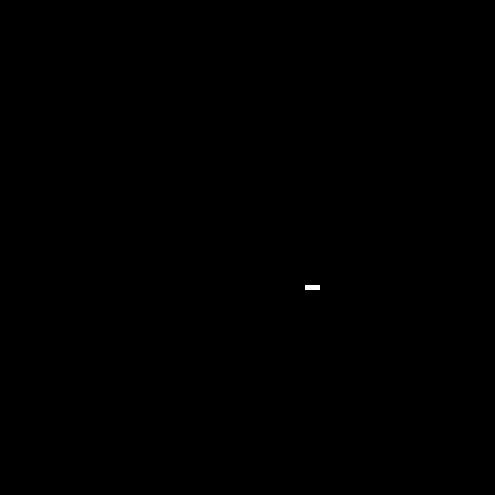
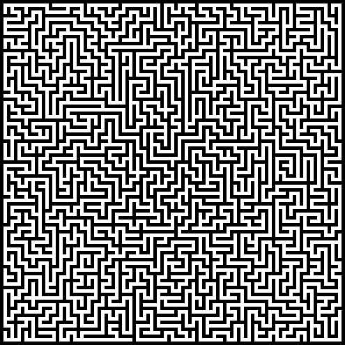
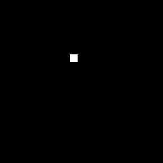
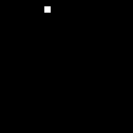
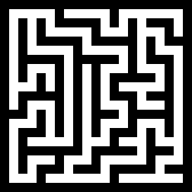
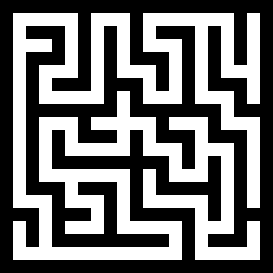
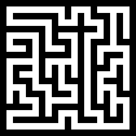
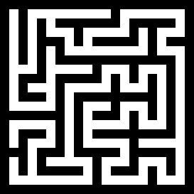

# Maze Visualiser


A Python project built with Pygame to visualise various maze generation and graph traversal algorithms in real time.

The project is designed to be an interactive learning tool, helping users understand how different algorithms behave by showing their execution step by step.

<div style="display: flex; flex-wrap: wrap; justify-content: center; gap: 20px;">
  
  
</div>

## Maze Generation Algorithms
### Iterative Backtracker
A depth-first search algorithm that uses a stack to track the current path. It moves randomly between unvisited neighbours and backtracks when there are no surrounding neighbours left to visit. This results in mazes with long winding passages and a low number of branches.



### Eller's Algorithm
A set-based algorithm that generates one row at a time, only requiring knowledge of the previous row to generate the next. Vertical and horizontal connections are made with a guarantee that sets are either merged together or survive until the next row, preventing isolations and loops. Passages are generally short with lots of branches.


### Kruskal's Algorithm
Another set-based algorithm that begins with each cell in a unique set. Walls are randomly removed between cells of different sets, then joining the sets until only one remains. Produces a minimal spanning tree with a variety of passage lengths and number of branches.


### Prim's Algorithm
An algorithm that grows from the starting cell, removing adjacent walls that are only divided by a single visited cell. Also produces a minimal spanning tree, however passages are generally shorter than mazes generated using Kruskal's algorithm.


### Aldous-Broder Algorithm
A random walk algorithm that moves between cells randomly, carving a passage when an unvisited cell is discovered. This results in a uniform spanning tree, but at the cost of efficiency because cells may be visited many times before the maze is fully generated.


### Wilson's Algorithm
This algorithm generates mazes using loop-erased random walks from unvisited cells to the existing maze. It also produces a uniform spanning tree and is more efficient that the Aldous-Broder algorithm, as cells are not revisited unless a loop is created.



## Graph Traversal Algorithms:
### A* Pathfinding
Heuristic based search algorithm that finds a path from the start to finish by prioritising nodes that are closest to the target, calculating distance travelled and distance remaining. It is efficient but does not guarantee the shortest path when there are multiple due to using a heuristic.



### Dijkstra's Algorithm
An algorithm that guarantees the shortest path between any two points in a graph, normally used in weighted graphs. It explores in all directions evenly so will usually find paths slower than the A* algorithm.



### Dead-End Filler
An algorithm that repeatedly fills in dead ends in a maze until the path from start to finish is left. This algorithm only works in perfect mazes and is less efficient than Dijkstra's algorithm and A*.



### Backtracking Algorithm
The backtracker is a depth-first search algorithm that works in the same way as the backtracking generation algorithm. This algorithm does not require any information about the maze aside from it's position and neighbours, but does not guarantee the shortest path.



### Random Mouse
This is the simplest solving strategy. The mouse moves in a random direction every step until the goal is reached. It is very inefficient and does not remember its path.


## Controls
- Select different generation/solving algorithms by clicking the buttons in the options panel
- ↑ / ↓ - Increase / decrease maze height
- ← / → - Increase / decrease maze width
- Click “Speed” button - Cycle through generation speeds

## Getting Started
1. Clone the repository:
   ```bash
   git clone https://github.com/dean-ba/maze-visualiser.git
   cd maze-visualiser
   ```
2. Install dependencies:  
   ```bash
   pip install pygame
   ```
3. Run the project:  
   ```bash
   python main.py
   ```
